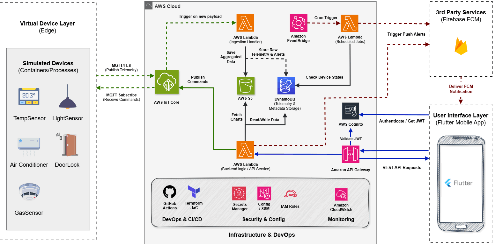

<div align="center">
  
  <br></br>
  <h1 align="center">Fleexa IoT Fleet Management</h1>

  <p align="center">
    <strong>A highly scalable, real-time IoT fleet management platform designed to monitor, analyze, and control smart devices at scale.</strong>
    <br />
    <br />
    <a href="#architecture-overview">Architecture</a>
    ·
    <a href="#core-features">Features</a>
    ·
    <a href="#getting-started">Getting Started</a>
    ·
    <a href="#device-catalog">Device Catalog</a>
  </p>
</div>

<div align="center">

[](https://github.com/Fleexa-Graduation-Project/IoT-Fleet-Management/actions/workflows/ci-cd.yml)
[](https://www.terraform.io/)
[](https://golang.org/)
[](https://python.org/)
[](https://aws.amazon.com/)
[](https://opensource.org/licenses/MIT)

</div>

---

## About The Project

The **Fleexa IoT Fleet Management** platform acts as the core for smart ecosystems. Whether deployed in industrial warehouses, smart homes, or commercial buildings, this platform allows administrators to ingest millions of data points, dynamically assess risk through intelligent rules, and control physical actuators seamlessly from the cloud.

Built from the ground up utilizing a **Serverless-First** approach on AWS, the system requires minimal operational overhead while remaining highly available and scalable.

---

## Architecture Overview



### The Data Flow
1. **Edge Simulation & Connectivity**: Dockerized Python simulators act as the edge devices. They authenticate natively with **AWS IoT Core** using strict Mutual TLS (mTLS) certificates and IoT Policies.
2. **Telemetry & Alerting Engine**: IoT Core Rules securely route incoming MQTT payloads to dedicated **AWS Lambda processors** written in high-performance Go.
3. **Smart Rule Evaluation**: The Go backend evaluates the data (e.g., verifying safe temperature thresholds or monitoring prolonged door access) and triggers an **Escalating Alerts Engine**.
4. **Data Persistence**: Processed states, telemetry histories, and commands are dispatched to heavily partitioned **Amazon DynamoDB** tables.
5. **Analytics Data Lake**: High-volume metrics are piped into an **Amazon S3 Data Lake** for long-term analytical queries.
6. **Client API & Security**: Cross-platform clients (e.g., Flutter mobile apps) authenticate via **Amazon Cognito**, securely accessing real-time overviews and dispatching control commands via **Amazon API Gateway**.

---

## Core Features

* **Real-Time Telemetry & Control**: Bi-directional MQTT communication with sub-second latency between edge devices and the cloud.
* **Escalating Alerts Engine**: Smart alerting rules. For example, a Door left open for 1m, 2m, 4m, 8m, and 16m triggers exponentially escalating push notifications.
* **Dynamic User Association**: Simulators authenticate with AWS to dynamically scan DynamoDB for authorized users, mapping physical devices to specific user accounts seamlessly.
* **Infrastructure as Code (IaC)**: Automated environment replication via robust, modular Terraform configurations. 
* **Serverless First**: Powered entirely by AWS managed services (IoT Core, Lambda, API Gateway, DynamoDB) maximizing cost-efficiency and minimizing operational overhead.

---

## Device Catalog

Our simulation engine dynamically supports multiple real-world sensor profiles:

| Device Type | Protocol | Data Sent | Example Triggers |
| :--- | :--- | :--- | :--- |
| **Temperature Sensor** | MQTT | Temp (°C), Humidity, Battery | Triggers alerts if Temp > 30°C or < 18°C. |
| **Door Sensor** | MQTT | Open/Closed Status, Intrusion | Triggers escalating alerts if left open too long. |
| **Gas Sensor** | MQTT | Smoke/CO2 Levels, Alarm | Emits critical alarms on abnormal gas levels. |
| **Light Sensor** | MQTT | Lux levels, Time of Day | Used to automate routines. |
| **Door Actuator** | MQTT | Lock/Unlock Commands | Cloud-controllable mechanical lock. |
| **AC/Curtain Actuator** | MQTT | Power State, Mode | Cloud-controllable relay for HVAC systems. |

---

## Database Schema (DynamoDB)

Data is strictly partitioned across optimized NoSQL tables:
- **`Users`**: Holds Cognito IDs, preferences, and FCM tokens for push notifications.
- **`Device State`**: Stores the absolute latest known state of every device for rapid dashboard loading.
- **`Telemetry`**: Time-series log of all historical sensor readings (uses TTL for cost efficiency).
- **`Alerts`**: Auditable log of all warnings and critical events generated by the rules engine.
- **`Commands`**: Command queue history tracking what the cloud instructed actuators to do.

---

## Repository Structure

```text
IoT-Fleet-Management/
├── backend/                  # Go microservices and rules engine
│   ├── cmd/                  # Entrypoints (api-service, door-watch, iot-ingestion)
│   ├── docs/                 # Architecture, database, and API documentation
│   ├── internal/             # Core domain logic (alerts, telemetry, users, auth)
│   ├── models/               # Shared data models and structs
│   └── pkg/                  # Shared utilities (db, logger)
├── design/                   # UI/UX design assets, wireframes, and fonts
├── devices/                  # Python device simulators
│   ├── certs/                # X.509 device certificates for AWS IoT Core mTLS
│   ├── simulators/           # Python simulation scripts (sensors and actuators)
│   └── tests/                # Unit and integration tests for simulators
├── docs/                     # General project documentation and setup guides
├── infra-iot-fleet/          # AWS Infrastructure as Code
│   └── terraform/            # Terraform modules (api_gateway, cognito, dynamodb)
├── mobile/                   # Flutter mobile application
│   ├── lib/                  # Source code (providers, screens, services, widgets)
│   └── test/                 # Mobile application tests
├── monitoring/               # CloudWatch dashboards and logging configurations
├── .github/workflows/        # Automated CI/CD pipelines
└── README.md                 # Project overview
```

---

## Security & Authentication

Security is implemented natively at every layer:
* **Edge Devices**: Hardware authenticates using X.509 Certificates (mTLS). IoT Policies strictly limit what topics a device can publish to based on its `ThingName`.
* **Mobile/Web Clients**: End-users authenticate via Amazon Cognito. API Gateway uses Cognito Authorizers to validate JWT tokens before fulfilling REST requests.
* **Cloud Infrastructure**: Principle of least privilege enforced via IAM execution roles generated strictly by Terraform.

---

## Getting Started

Follow these instructions to provision the environment in your AWS account and launch the simulators.

### Prerequisites
* [AWS CLI v2](https://aws.amazon.com/cli/) configured with Administrator credentials.
* [Terraform](https://www.terraform.io/downloads.html) (>= 1.14.0)
* [Docker & Docker Compose](https://docs.docker.com/get-docker/)
* [Go](https://golang.org/doc/install) (>= 1.24.2)
* [Python 3.11](https://www.python.org/downloads/) (for local simulator development)

### 1. Infrastructure Deployment (AWS)

1. Navigate to the Terraform directory:
   ```bash
   cd infra-iot-fleet/terraform
   ```
2. Initialize and validate the modules:
   ```bash
   terraform init
   terraform validate
   ```
3. Apply the infrastructure:
   ```bash
   terraform apply -var="aws_region=us-east-1"
   ```
   *(Terraform will output your new IoT Core Endpoint, API Gateway URL, and Cognito details upon completion).*

### 2. Running the Device Simulators (Docker)

Our simulators dynamically generate real telemetry and act upon cloud commands.

1. Navigate to the `devices` directory and create a `.env` file from the example:
   ```bash
   cd devices
   cp .env.example .env
   ```
2. Open the `.env` file and securely add your AWS credentials so the simulators can dynamically fetch test users from DynamoDB:
   ```text
   # devices/.env
   AWS_ACCESS_KEY_ID=your-access-key
   AWS_SECRET_ACCESS_KEY=your-secret-key
   AWS_REGION=us-east-1
   ```
   *(Note: The `.env` file is included in `.gitignore` to prevent accidental credential leaks).*

3. Build and start the simulator containers:
   ```bash
   docker compose up --build -d
   ```
4. Follow the live simulator telemetry generation:
   ```bash
   docker compose logs -f
   ```

---

## CI/CD Pipeline Workflow

This project utilizes **GitHub Actions** to enforce code quality and zero-downtime deployments.

1. **Test Job**: Runs `go test ./...` on the backend and Python `pytest` for the IoT edge schemas.
2. **Docker Build Job**: Validates that edge device container images build successfully.
3. **Terraform Plan**: Generates an execution plan on all Pull Requests.
4. **Terraform Deploy**: Automatically applies IaC changes when pushing to the `main` or `Lambda-CI/CD-Implementation` branches.
5. **Verification Job**: Validates the cloud environment by dynamically checking if all required DynamoDB tables, Lambda Functions, and S3 Data Lake buckets successfully exist.

---

## Contributing
Contributions are what make the open-source community an amazing place to learn, inspire, and create. Any contributions you make are greatly appreciated.

1. Fork the Project
2. Create your Feature Branch (`git checkout -b feature/AmazingFeature`)
3. Commit your Changes (`git commit -m 'Add some AmazingFeature'`)
4. Push to the Branch (`git push origin feature/AmazingFeature`)
5. Open a Pull Request

---

## License
Distributed under the MIT License. See `LICENSE` for more information.

<p align="right"><a href="#fleexa-iot-fleet-management">Back to top</a></p>