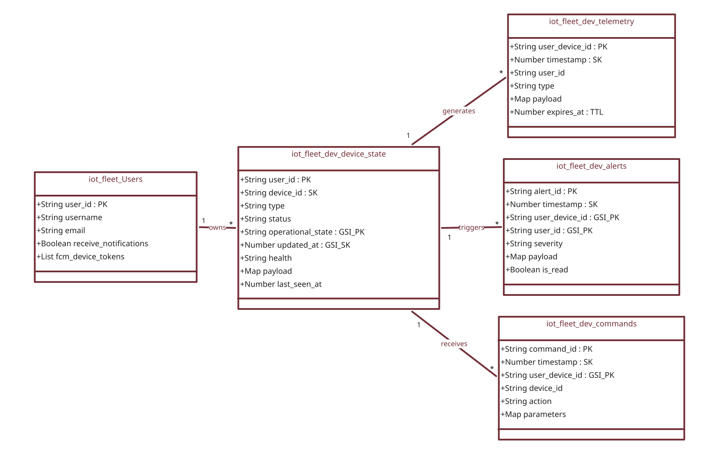

<div align="center">
  
  <br></br>
  <h1 align="center">Fleexa Backend</h1>

  <p align="center">
    <strong>The serverless Go backend powering real-time telemetry, alerting, and fleet control for Fleexa.</strong>
    <br />
    <br />
    <a href="#architecture">Architecture</a>
    ·
    <a href="#repository-structure">Structure</a>
    ·
    <a href="#database-schema">Database</a>
    ·
    <a href="#rest-api">API</a>
    ·
    <a href="#getting-started">Getting Started</a>
  </p>
</div>

<div align="center">

[](https://golang.org/)
[](https://aws.amazon.com/lambda/)
[](https://aws.amazon.com/dynamodb/)
[](https://aws.amazon.com/cognito/)
[](https://firebase.google.com/docs/cloud-messaging)
[](../LICENSE)

</div>

---

## About

The backend is a fully serverless, multi tenant Go service, and its design is intentionally decoupled from any specific device category. The same ingestion pipeline, rules engine, and alert system can take in data from any other device type or domain without touching the code, adding a new device type is a single entry in the rules engine, nothing else in the system needs to change.  The smart home sensors and actuators used in this project (temperature, gas, light, door locks, AC) are only the demonstration layer. 

On top of that generic pipeline, the backend ingests MQTT telemetry from every device, runs the rules and alert engine, serves the Flutter app's REST API, and pushes real time alerts through Firebase. Every request and every record is scoped to the signed in user, so each account only ever sees its own fleet.

---

## Architecture

The backend runs as five independent AWS Lambda functions, each with a single responsibility.

| Function | Trigger | Responsibility |
| :--- | :--- | :--- |
| **`api-service`** | API Gateway (HTTP) | Serves the REST API behind a Gin router. Validates JWTs, reads device state and telemetry, dispatches commands. |
| **`iot-ingestion`** | AWS IoT Core (MQTT) | Validates every incoming message, updates device state, runs the rules engine, saves alerts, sends push notifications. |
| **`door-watch`** | EventBridge, every 1 min | Scans open or unlocked doors and fires escalating alerts (WARNING at 7 min, CRITICAL at 15 / 30 / 60 / 120 min). |
| **`ac-timer-watch`** | EventBridge, every 1 min | Finds AC units whose sleep timer has expired, publishes an MQTT OFF command, and clears the timer state. |
| **`db-export`** | Manual / scheduled | Exports selected DynamoDB tables to S3 for backups and offline analysis. |

Each function shares the same internal packages but keeps its own `cmd/` entrypoint, so it can be deployed, scaled, and rolled back independently.

---

## Repository Structure

```text
backend/
├── cmd/
│   ├── api-service/       # REST API, Gin router behind API Gateway
│   ├── iot-ingestion/     # MQTT message processor
│   ├── door-watch/        # Scheduled door alert escalation
│   ├── ac-timer-watch/    # Scheduled AC auto shutoff
│   └── db-export/         # DynamoDB to S3 export tool
├── internal/
│   ├── alerts/            # Alert storage and retrieval
│   ├── api/handlers/      # HTTP handlers (devices, auth, users, weather)
│   ├── auth/               # Cognito client + JWT middleware
│   ├── commands/          # Command storage and history
│   ├── devices/           # Device state store and operational rules
│   ├── ingestion/         # MQTT envelope validation and routing
│   ├── iot/               # IoT Core publisher + S3 cold tier reads
│   ├── notifications/     # Firebase push notification service
│   ├── rules/             # Rules and alert engine (per device type)
│   ├── telemetry/         # Time series storage and chart aggregation
│   ├── users/             # User profile and FCM token store
│   └── validation/        # MQTT payload schema validation
├── models/                # Shared structs (Device, Telemetry, Alert, Command, User)
├── pkg/
│   ├── db/                # Singleton DynamoDB client
│   └── logger/            # Structured JSON logger
├── scripts/               # daily_aggregator.py and other Lambda scripts
└── docs/                  # API, database, and MQTT schema references
```

---

## Data Tiering

| Tier | Store | Window | Used For |
| :--- | :--- | :--- | :--- |
| **Hot** | DynamoDB | Last 24 hours | Live dashboards, device state, real time queries |
| **Cold** | S3 (pre aggregated JSON) | 7 days, 1 month | Historical charts, long term trends |

The `/devices/:id/telemetry` endpoint accepts a `period` query parameter (`24h`, `7d`, `1m`) and automatically routes to the correct tier, so the client never needs to know where the data actually lives.

---

## Database Schema

Every table is scoped by user, so no query ever crosses accounts.



| Table | Partition Key | Sort Key | Notes |
| :--- | :--- | :--- | :--- |
| **`Fleexa_Devices`** | `user_id` | `device_id` | Live device state. GSI `OpenDoorsIndex` (on `operational_state`) for the door watch scan. |
| **`Fleexa_Telemetry`** | `user_device_id` | `timestamp` | Raw sensor readings. 7 day TTL. |
| **`Fleexa_Alerts`** | `user_device_id` | `timestamp` | GSI `DeviceAlertsIndex` and `UserAlertsIndex` for per device and per user alert history. |
| **`Fleexa_Commands`** | `user_device_id` | `timestamp` | Full command history. GSI `DeviceHistoryIndex`. 7 day TTL. |
| **`Fleexa_Users`** | `user_id` | — | Profile, notification preferences, and a `hardware_id` keyed map of FCM tokens for multi device push. |

---

## REST API

All routes are versioned under `/api/v1`. Protected routes require a Cognito access token as a Bearer header.

| Group | Endpoint | Auth |
| :--- | :--- | :---: |
| **Auth** | `POST /auth/signup` `POST /auth/signin` `POST /auth/refresh` `POST /auth/forgot-password` `POST /auth/reset-password` | Public |
| **Auth** | `POST /auth/change-password` `GET /auth/profile` `DELETE /auth/account` | Private |
| **Devices** | `GET /devices` `GET /devices/:id` `GET /devices/:id/telemetry` `GET /devices/:id/alerts` `POST /devices/:id/commands` `PUT /devices/:id/preferences` | Private |
| **Alerts** | `GET /alerts` `PUT /alerts/read` | Private |
| **Users** | `GET /users/preferences` `PUT /users/preferences` | Private |
| **System** | `GET /system/overview` | Private |

---

## Getting Started

### Prerequisites
* [Go](https://golang.org/doc/install) >= 1.24.2
* An AWS account with DynamoDB, IoT Core, and Cognito provisioned (see [`infra-iot-fleet/`](../infra-iot-fleet))

### Environment Variables

```bash
export STATE_TABLE=Fleexa_Devices
export TELEMETRY_TABLE=Fleexa_Telemetry
export ALERTS_TABLE=Fleexa_Alerts
export COMMANDS_TABLE=Fleexa_Commands
export USERS_TABLE=Fleexa_Users
export BUCKET_NAME=fleexa-data-lake
export FIREBASE_CREDENTIALS=./firebase-adminsdk.json
export COGNITO_USER_POOL_ID=us-east-1_xxxxxxxxx
export COGNITO_CLIENT_ID=xxxxxxxxxxxxxxxxxxxxxxxxxx
export IOT_ENDPOINT=your-iot-endpoint.iot.us-east-1.amazonaws.com
export AWS_REGION=us-east-1
```

### Build & Run

```bash
go mod download

# Build every Lambda binary
go build -o bin/api ./cmd/api-service
go build -o bin/ingestion ./cmd/iot-ingestion
go build -o bin/door-watch ./cmd/door-watch
go build -o bin/ac-timer-watch ./cmd/ac-timer-watch

# Run the API locally
./bin/api
```

### Test

```bash
go test ./...
```

---

## Security

* **Authentication:** Delegated entirely to Amazon Cognito. No passwords are ever stored by the backend.
* **Authorization:** Every protected route validates a JWT locally against cached Cognito signing keys, no external call per request.
* **Data isolation:** Every table key and every MQTT topic includes the user's ID, so one account can never read or command another's devices.
* **Least privilege:** Each Lambda has its own IAM role, scoped only to the tables and services it actually needs.

---

## License
Distributed under the MIT License. See [`LICENSE`](../LICENSE) for details.

<p align="right"><a href="#fleexa-backend">Back to top</a></p>
